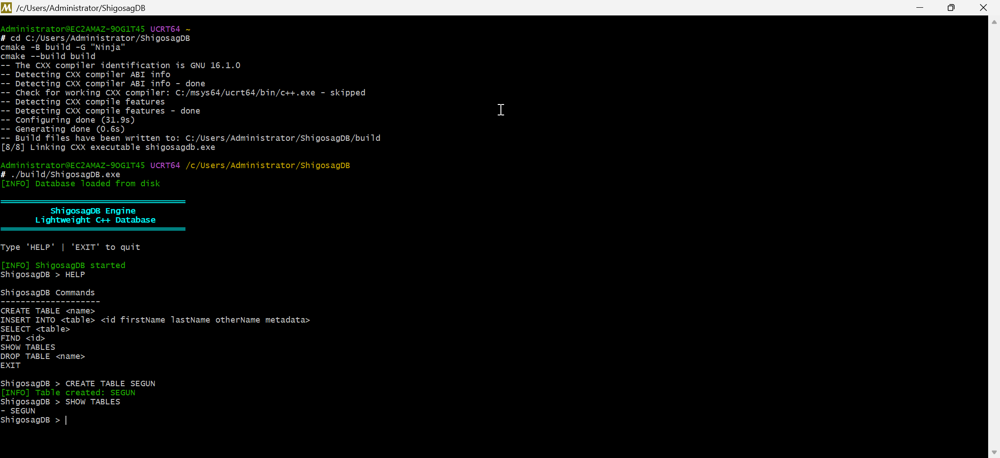

# 🗄️ ShigosagDB Engine

A lightweight, modern, and educational **C++ database engine** built from scratch, featuring a CLI interface, persistent storage, and structured record handling.

> ⚡ Built for learning systems design, database internals, and low-level C++ architecture  
> 👨‍💻 Author: Shigosag  
> 🎯 Focus: Performance, simplicity, and real database behavior



### 🎥 Database Engine Demo & Walkthrough

<div align="center">
  <video src="https://github.com/user-attachments/assets/c737c6af-24d2-424a-b41e-5494b1e6bbe9" width="100%" controls></video>
</div>

**Timestamps:**
- **0:00** - Database build
- **0:40** - Database launch & branding banner
- **0:47** - Command input interface
- **0:59** - GitHub Repository Overview

---

## 🚀 Features

- 🧠 Custom SQL-like CLI parser
- 📁 Persistent file-based storage (.tbl)
- 🗂️ Table management (CREATE / DROP / SHOW)
- ✍️ Insert structured records
- 🔍 Query support (SELECT / FIND)
- 💾 Auto-load database on startup
- 🧾 Logging system with colored output
- ⚡ Lightweight and fast C++ engine
- 🧱 Modular architecture (Storage, Parser, Engine, Core)

---

## 🗂️ Folder Structure

```text
ShigosagDB/
│
├── CMakeLists.txt
│
├── data/
│   ├── tables/
│   └── wal/
│
├── include/
│   ├── core/
│   │   ├── Database.hpp
│   │   ├── StorageEngine.hpp
│   │   ├── Table.hpp
│   │   └── Record.hpp
│   │
│   ├── parser/
│   │   ├── Tokenizer.hpp
│   │   ├── Parser.hpp
│   │   └── AST.hpp
│   │
│   ├── index/
│   │   └── BPlusTree.hpp (optional / future modules)
│   │
│   ├── transaction/
│   │   └── TransactionManager.hpp (optional / future modules)
│   │
│   └── utils/
│       ├── Logger.hpp
│       └── Colors.hpp
│
├── src/
│   ├── main.cpp
│   │
│   ├── core/
│   │   ├── Database.cpp
│   │   ├── StorageEngine.cpp
│   │   └── Table.cpp
│   │
│   ├── parser/
│   │   ├── Tokenizer.cpp
│   │   └── Parser.cpp
│   │
│   ├── index/
│   │   └── BPlusTree.cpp
│   │
│   ├── transaction/
│   │   └── TransactionManager.cpp (optional / future modules)
│   │
│   └── utils/
│       └── Logger.cpp
│
├── tests/
│   └── database_tests.cpp
│
└── README.md
```

---

## ⚙️ Prerequisites

- CMake: https://cmake.org/download/
- MSYS2: https://www.msys2.org/
- Windows / Linux / WSL

---

## 🛠️ Installation

### Install toolchain 
Open MSYS2 UCRT64 terminal:

```bash
pacman -S mingw-w64-ucrt-x86_64-gcc
pacman -S make
pacman -S mingw-w64-ucrt-x86_64-ninja
pacman -S mingw-w64-ucrt-x86_64-boost
pacman -S mingw-w64-ucrt-x86_64-cmake
```

### Clone Repository

```bash
git clone https://github.com/Shigosag/ShigosagDB.git

cd ShigosagDB
```

---

## 🔨 Build Instructions

```bash
cmake -B build -G "Ninja"
cmake --build build
```

## ▶️ Run

```bash
./build/ShigosagDB.exe
```

---

## 🧪 Supported Commands

```sql
CREATE TABLE users
INSERT INTO users 1 Segun Arulogun Gabriel meta
SELECT users
FIND 1
SHOW TABLES
DROP TABLE users
EXIT
```

---

## 📁 Example Usage

```bash
ShigosagDB > CREATE TABLE users
ShigosagDB > INSERT INTO users 1 Segun Arulogun Gabriel meta
ShigosagDB > SELECT users
1 Segun Arulogun Gabriel meta

ShigosagDB > SHOW TABLES
- users
```

---

## 💾 Storage Format

Each table is stored as a .tbl file:
```bash
data/tables/users.tbl
```

Example:
```bash
1,Segun,Arulogun,Gabriel,meta
2,John,Doe,Smith,dev
```

---

## 🎨 CLI Design

- 🩵 Banner: Bold + Cyan
- 🟢 Info logs: Green
- 🟡 Warnings: Yellow
- 🔴 Errors: Red
- 💻 Prompt: Clean terminal-style interface

---

## 📌 Project Goals

This project demonstrates:
- Database engine internals
- File-based persistence system
- SQL parsing logic
- CLI architecture design
- C++ system-level programming

---

## ⚡ Future Improvements

- WHERE clause support
- SELECT * FROM syntax
- Indexing (B+ Tree)
- Transaction system (COMMIT / ROLLBACK)
- WAL (Write-Ahead Logging)
- Query optimizer
- Memory caching layer

---

## 👤 Author & Credits

- **Shigosag**
- Portions of code generated with AI support

Project: ShigosagDB Engine

---

## 📄 License

MIT License (This project is for educational and portfolio purposes)

© 2026 Shigosag

---
